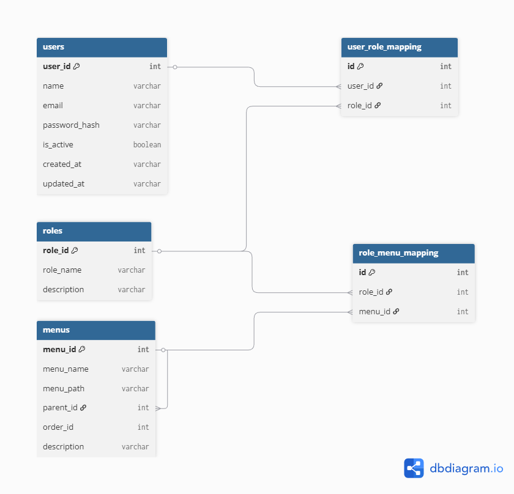

# DB Structure (Users, Roles, Menus, Mappings)

1. Users table
2. Roles table
3. Menus table
4. Role–Menu mapping
5. User–Role mapping

## 1. users Table

| Column        | Type                 |
| ------------- | -------------------- |
| user_id       | Int PRIMARY KEY      |
| name          | String               |
| email         | String UNIQUE        |
| password_hash | String               |
| is_active     | Boolean DEFAULT true |
| created_at    | String DEFAULT NOW() |
| updated_at    | String DEFAULT NOW() |

## 2. roles Table

| Column      | Type            |
| ----------- | --------------- |
| role_id     | Int PRIMARY KEY |
| role_name   | String UNIQUE   |
| description | String          |

## 3. menus Table

| Column    | Type                     |
| --------- | ------------------------ |
| menu_id   | Int PRIMARY KEY          |
| menu_name | String                   |
| menu_path | String                   |
| parent_id | Int (FK → menus.menu_id) |
| order_no  | Int DEFAULT 0            |
| desc      | String                   |

## 4. role_menu_mapping Table

| Column  | Type                   |
| ------- | ---------------------- |
| id      | Int PRIMARY KEY        |
| role_id | Int FK → roles.role_id |
| menu_id | Int FK → menus.menu_id |

## 5. user_role_mapping Table

| Column  | Type                   |
| ------- | ---------------------- |
| id      | Int PRIMARY KEY        |
| user_id | Int FK → users.user_id |
| role_id | Int FK → roles.role_id |

## Image

